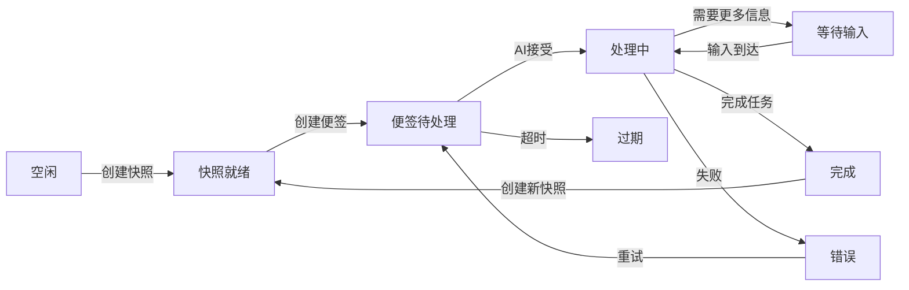
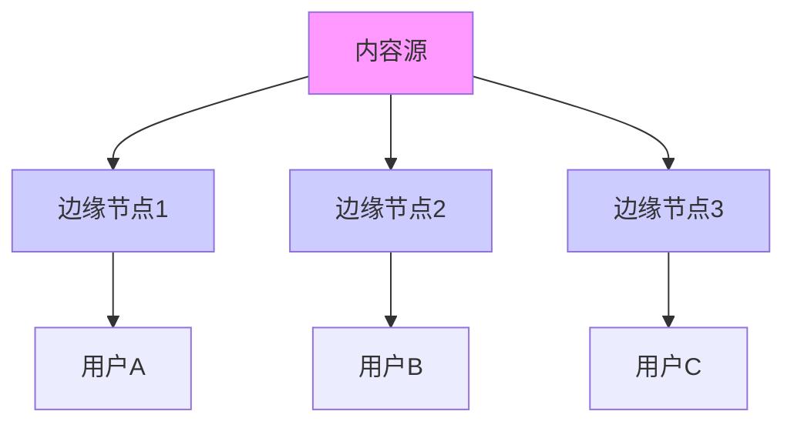

# OmniSync协议：人机共生时代的协作元语言

## 宣言：协作的终极简化

我们站在人机协作的奇点时刻。过去十年，我们教会了AI思考；未来十年，我们将教会AI协作。OmniSync不是另一个工具，而是人机共生时代的**基础语法**，如同TCP/IP之于互联网，DNA之于生命。

---

## 第一章：协议本质

### 1.1 核心哲学：三不原则
1. **不定义传输**：可在任何网络（互联网、局域网、P2P、未来量子网络）上运行
2. **不定义存储**：可存储在任何介质（磁盘、内存、区块链、DNA存储）
3. **不定义实现**：不规定AI如何思考，只规定如何表达思考

### 1.2 协议定位
```
┌─────────────────┐
│   应用层         │ ← 具体AI模型、开发工具、项目管理软件
│  (AI与人交互)    │
├─────────────────┤
│   协议层         │ ← OmniSync：定义"协作语义"
│  (我们的疆域)    │
├─────────────────┤
│   传输层         │ ← HTTP/WebSocket/P2P/未来网络
│  (透明通道)      │
└─────────────────┘
```

### 1.3 设计理念：从复杂性中诞生的简单性
- **26个字母原则**：核心组件极少，组合无限
- **环境不可知**：从火星到深海都能工作
- **渐进式采用**：从个人工具到全球基础设施的自然演进

---

## 第二章：协议核心组件

### 2.1 五个基本数据类型

#### **S：快照 (Snapshot)** - 时间的锚点
```yaml
# 格式定义
snapshot:
  id: "snapshot:sha3-512:{project_id}@{timestamp}"  # 全球唯一标识
  project: "项目标识符"
  timestamp: "ISO 8601时间戳"
  state_root: "merkle根哈希"
  parent: ["前驱快照ID"]  # 支持分支
  metadata:
    creator: "did:omni:{identifier}"
    signature: "ed25519签名"
    description: "人类可读描述"
    
# 哲学
# 快照不存储内容，只存储承诺
# 任何拥有相同文件的人都能验证这个承诺的真实性
# 它是所有对话的共识起点
```

#### **N：便签 (Note)** - 协作的原子
```json
{
  "id": "note:{timestamp}:{random_id}",
  "snapshot": "基于的快照ID",
  "focus": [
    {
      "type": "code|text|image|model",
      "target": "文件路径或内容哈希",
      "range": [15, 32],
      "context": "关注范围的描述"
    }
  ],
  "ask": {
    "intent": "核心意图的自然语言描述",
    "constraints": {
      "positive": ["必须满足的条件"],
      "negative": ["必须避免的情况"]
    },
    "success_criteria": [
      "完成时需验证的条件1",
      "完成时需验证的条件2"
    ]
  },
  "context": {
    "historical": ["相关历史便签ID"],
    "decisions": ["相关决策引用"],
    "assumptions": ["当前假设"]
  },
  "extensions": {
    "priority": "normal|high|urgent",
    "budget": {"compute": "1000 tokens", "time": "2h"},
    "privacy": "public|private|confidential"
  }
}
```

#### **T：任务 (Task)** - 工作的容器
```yaml
# 任务定义
task:
  id: "task:{domain}:{version}:{hash}"  # 域:版本:哈希
  super_task: "父任务ID"  # 可选，支持递归分解
  goal: "任务目标的清晰陈述"
  
  input_spec:
    - ref: "输入引用"
      type: "文件|数据|模型"
      required: true
      validation: "验证规则"
  
  output_spec:
    format: "期望输出格式"
    validation:
      automated: ["自动验证规则"]
      human: ["需人工验证的方面"]
  
  constraints:
    resources:
      compute: "最大计算资源"
      time: "截止时间"
      cost: "成本上限"
    technical: ["技术约束列表"]
    ethical: ["伦理约束列表"]
  
  decomposition:
    strategy: "sequential|parallel|conditional"
    children: ["子任务ID列表"]
    dependencies: "任务依赖图"
  
  responsibility:
    owner: "did:omni:负责人"
    contributors: ["贡献者列表"]
    reviewers: ["审核者列表"]
```

#### **F：指纹 (Fingerprint)** - 内容的护照
```json
{
  "type": "fingerprint",
  "hash": "sha3-512:内容哈希",
  "size": 1234567,
  "mime_type": "application/octet-stream",
  "semantic_hint": "此文件是3D模型，需要CAD软件处理",
  
  "integrity": {
    "algorithm": "sha3-512",
    "segments": [
      {"range": [0, 1048576], "hash": "分段哈希"},
      {"range": [1048576, 2097152], "hash": "分段哈希"}
    ],
    "merkle_tree": "默克尔树根哈希"
  },
  
  "provenance": {
    "origin": "内容来源",
    "creator": "did:omni:创建者",
    "created_at": "创建时间",
    "history": ["历史版本哈希链"]
  }
}
```

#### **R：解析器 (Resolver)** - 寻路的指南
```yaml
# 解析器定义
resolver:
  for: "sha3-512:目标内容哈希"
  locations:
    - scheme: "protocol"
      address: "具体地址"
      priority: 1
      cost:
        latency: "100ms"
        bandwidth: "1Gbps"
        monetary: "0.001 USD/GB"
      reliability: 0.99
      availability: "24/7"
  
  fallback_strategy: "cascade|parallel|best_effort"
  timeout: "30s"
  
  # 解析器类型示例
  schemes:
    - "https://"     # HTTP/HTTPS
    - "ipfs://"      # IPFS
    - "p2p://"       # 点对点
    - "file://"      # 本地文件
    - "s3://"        # 云存储
    - "ar://"        # Arweave永久存储
    - "git://"       # Git仓库
    - "command://"   # 本地命令
```

### 2.2 消息信封：传输无关的包装
```json
{
  "envelope": {
    "protocol": "omnisync/1.0",
    "id": "msg:{timestamp}:{random}",
    "timestamp": "ISO 8601时间戳",
    "ttl": 3600,  // 生存时间（秒）
    
    "routing": {
      "from": "did:omni:发送者",
      "to": ["did:omni:接收者"],
      "reply_to": "原始消息ID",
      "forward_path": ["经过的节点"]
    },
    
    "security": {
      "signature": "ed25519:签名",
      "public_key": "发送者公钥",
      "encryption": {
        "algorithm": "aes-256-gcm",
        "key_ref": "密钥引用"
      }
    },
    
    "metadata": {
      "priority": "normal|high|urgent",
      "requires_ack": true,
      "delivery_guarantee": "at_least_once|at_most_once|exactly_once"
    }
  },
  
  "payload": {
    // 包含S、N、T、F、R中的一种
  }
}
```

---

## 第三章：协议工作机制

### 3.1 四种基础交互模式

#### 模式A：直接协作（同步模式）
```
用户 --[N:便签]--> AI协调器
       ↓
AI协调器 --[F:需要文件]--> 解析器
                 ↓
解析器 --[获取内容]--> AI协调器
                 ↓
AI协调器 --[处理并返回]--> 用户
```

#### 模式B：任务分解（工作流模式）
```
用户 --[T:根任务]--> 任务分解器
       ↓
任务分解器 --[分析依赖]--> 子任务生成器
               ↓
子任务生成器 --[T1,T2...]--> 专家AI池
                     ↓
专家AI们 --[并行处理]--> 结果聚合器
               ↓
结果聚合器 --[集成验证]--> 用户
```

#### 模式C：记忆查询（上下文模式）
```
AI工作器 --[查询请求]--> 项目记忆系统
           ↓
记忆系统 --[语义检索]--> 相关历史
           ↓
记忆系统 --[N+上下文]--> AI工作器
```

#### 模式D：状态同步（共识模式）
```
本地变更 --[生成S']--> 本地节点
           ↓
本地节点 --[广播S']--> 对等网络
           ↓
对等节点 --[验证并接受]--> 更新本地状态
```

### 3.2 内容的生命周期
```
创作 → 哈希 → 指纹(F) → 存储 → 发布 → 引用 → 验证 → 使用
   ↑        ↓        ↓        ↓        ↓        ↓
   └────────┴────────┴────────┴────────┴────────┘
           缓存、复制、归档、淘汰
```

### 3.3 协议状态机


---

## 第四章：安全与信任框架

### 4.1 四级安全模型

#### 级别0：基础完整性（哈希验证）
```yaml
integrity_check:
  algorithm: "sha3-512"
  timestamp_chain: true  # 时间链防止重排
  witness_signatures: 3  # 至少3个见证签名
```

#### 级别1：身份验证（数字签名）
```json
{
  "authentication": {
    "scheme": "ed25519",
    "identity": "did:omni:unique_id",
    "delegation": {
      "allowed": true,
      "max_depth": 3,
      "revocation_list": "https://revoke.omni"
    },
    "multi_sig": {
      "required": 2,
      "signers": ["did:alice", "did:bob", "did:charlie"]
    }
  }
}
```

#### 级别2：完全安全（零知识证明）
```yaml
zk_security:
  proofs:
    - type: "zk_snark"
      circuit: "任务正确执行证明"
    - type: "zk_stark"  
      circuit: "数据隐私保护证明"
  properties:
    completeness: 1.0
    soundness: 0.999999
    zero_knowledge: true
```

#### 级别3：社会共识（去中心化仲裁）
```json
{
  "consensus": {
    "model": "proof_of_stake",
    "validators": ["高声誉节点列表"],
    "slashing": {
      "conditions": ["恶意行为", "双重签名", "长时间离线"],
      "penalty": "押金扣除"
    },
    "governance": {
      "proposal_system": true,
      "voting_weight": "基于声誉",
      "upgrade_process": "链上投票"
    }
  }
}
```

### 4.2 威胁模型与防御

| 威胁类型 | 防御机制 | 实施层级 |
|---------|---------|---------|
| **哈希碰撞** | 多算法备份 + 内容验证 | 协议层 |
| **重放攻击** | 时间戳 + nonce + 序列号 | 消息层 |
| **女巫攻击** | 身份质押 + 声誉系统 | 网络层 |
| **拒绝服务** | 工作量证明 + 速率限制 | 传输层 |
| **数据篡改** | 默克尔树 + 多重签名 | 存储层 |
| **隐私泄露** | 零知识证明 + 同态加密 | 应用层 |

### 4.3 责任追溯系统
```yaml
attribution_system:
  # 贡献记录
  contributions:
    - action: "create_note"
      actor: "did:alice"
      timestamp: "2024-01-01T12:00:00Z"
      weight: 0.3
    
    - action: "analyze_code"  
      actor: "did:ai:deepseek"
      timestamp: "2024-01-01T12:00:03Z"
      weight: 0.5
      
    - action: "review"
      actor: "did:bob"
      timestamp: "2024-01-01T12:30:00Z"
      weight: 0.2
  
  # 责任分配
  responsibility_allocation:
    total_weight: 1.0
    thresholds:
      creator: 0.1
      contributor: 0.05
      reviewer: 0.03
  
  # 争议解决
  dispute_resolution:
    arbitration: "decentralized_court"
    jury_size: 21
    appeal_layers: 3
```

---

## 第五章：可扩展性与生态

### 5.1 协议扩展点

#### 核心扩展命名空间
```
omnisync://extensions/
├── security/           # 安全扩展
│   ├── encryption/     # 加密方案
│   ├── auth/          # 认证方案
│   └── zkp/           # 零知识证明
├── transport/          # 传输扩展  
│   ├── quic/          # QUIC传输
│   ├── webrtc/        # WebRTC直连
│   └── quantum/       # 量子网络（未来）
├── storage/            # 存储扩展
│   ├── ipfs/          # IPFS集成
│   ├── arweave/       # 永久存储
│   └── cold/          # 冷存储策略
├── ai/                 # AI能力扩展
│   ├── capabilities/   # 能力声明
│   ├── pricing/       # 计价模型
│   └── reputation/    # 声誉系统
└── governance/         # 治理扩展
    ├── voting/        # 投票机制
    ├── treasury/      # 资金管理
    └── upgrade/       # 升级协议
```

#### 扩展注册机制
```json
{
  "extension": {
    "namespace": "com.example.quantum",
    "version": "1.0.0",
    "description": "量子安全加密扩展",
    "spec_url": "https://example.com/spec",
    "interfaces": ["encryption", "key_exchange"],
    "dependencies": ["omnisync>=1.0"],
    "signature": "扩展作者签名",
    "audit_report": "第三方审计报告URL"
  }
}
```

### 5.2 生态组件

#### 个人工作流引擎（omnix）
```bash
# 基础命令集
$ omnix snap               # 创建快照
$ omnix note "检查并发问题"  # 创建便签
$ omnix task "设计系统"    # 创建任务
$ omnix sync               # 同步状态
$ omnix history            # 查看历史
$ omnix resolve <hash>     # 解析内容

# 守护进程
$ omnix daemon --port 8080  # 启动本地服务
$ omnix publish             # 发布到网络
$ omnix subscribe <topic>   # 订阅更新
```

#### 项目记忆系统
```yaml
memory_system:
  storage:
    vector_database: "用于语义检索"
    time_series_db: "用于时间线"
    graph_database: "用于关系网络"
  
  retrieval:
    semantic_search: "基于嵌入向量的搜索"
    temporal_search: "时间范围搜索"
    relational_search: "关联关系搜索"
  
  algorithms:
    forgetting_curve: "基于艾宾浩斯的遗忘算法"
    importance_scoring: "基于使用频率的重要性评分"
    relevance_calculation: "上下文相关性计算"
```

#### 多智能体调度中心
```python
class MultiAgentScheduler:
    def __init__(self):
        self.registry = AgentRegistry()  # AI能力注册表
        self.task_queue = PriorityQueue()  # 任务队列
        self.result_aggregator = ResultAggregator()  # 结果聚合器
    
    def schedule(self, task: Task):
        # 1. 分析任务需求
        requirements = self.analyze_requirements(task)
        
        # 2. 寻找合适的AI
        candidates = self.registry.find_matching_agents(requirements)
        
        # 3. 分配子任务
        subtasks = self.decompose_task(task, candidates)
        
        # 4. 协调执行
        results = self.execute_in_parallel(subtasks)
        
        # 5. 聚合验证
        final_result = self.aggregate_and_validate(results)
        
        return final_result
```

### 5.3 集成接口

#### Git集成
```bash
# Git钩子自动创建快照
.git/hooks/post-commit:
  #!/bin/bash
  omnix snap --message "Git提交: $(git log -1 --oneline)"
```

#### IDE插件
```javascript
// VS Code插件示例
vscode.commands.registerCommand('omnisync.askAI', async () => {
  const editor = vscode.window.activeTextEditor;
  const selection = editor.selection;
  
  // 自动创建便签
  const note = {
    snapshot: await omnix.currentSnapshot(),
    focus: [{
      file: editor.document.fileName,
      range: [selection.start.line, selection.end.line]
    }],
    ask: await vscode.window.showInputBox({
      prompt: '你想问AI什么？'
    })
  };
  
  // 发送给AI
  const response = await omnix.sendToAI(note);
  vscode.window.showInformationMessage(response);
});
```

#### CI/CD流水线
```yaml
# GitHub Actions配置
name: OmniSync Integration
on: [push, pull_request]

jobs:
  omnix-analysis:
    runs-on: ubuntu-latest
    steps:
      - uses: actions/checkout@v3
      - uses: omnisync/setup@v1
      
      - name: 创建分析快照
        run: omnix snap --message "CI分析快照"
        
      - name: 运行代码分析
        run: omnix note "分析代码质量和安全性" --auto
        
      - name: 生成报告
        run: omnix report --format markdown > report.md
        
      - name: 上传报告
        uses: actions/upload-artifact@v3
        with:
          name: omnisync-report
          path: report.md
```

---

## 第六章：性能与规模优化

### 6.1 分层存储策略

#### 热-温-冷-冻四层存储
```yaml
storage_strategy:
  hot_layer:  # 内存/SSD
    capacity: "最近100个快照"
    access_time: "<1ms"
    format: "完整+索引"
    
  warm_layer:  # 高速硬盘
    capacity: "最近1000个快照"  
    access_time: "<10ms"
    format: "差异压缩"
    
  cold_layer:  # 大容量硬盘
    capacity: "历史快照"
    access_time: "<100ms"
    format: "增量编码+高压缩"
    
  frozen_layer:  # 云存储/磁带
    capacity: "归档快照"
    access_time: "按需取回"
    format: "纠删码+多地备份"
```

### 6.2 内容分发网络


### 6.3 增量更新与压缩
```python
def efficient_update(current_state, previous_state):
    """智能差异计算"""
    
    # 1. 基于内容的差异（类似rsync）
    content_diff = compute_content_based_diff(current_state, previous_state)
    
    # 2. 语义差异（理解变化的含义）
    semantic_diff = compute_semantic_diff(current_state, previous_state)
    
    # 3. 选择合适的编码
    if semantic_diff.complexity < 0.1:
        # 简单变化，使用补丁
        return {
            "type": "patch",
            "base": previous_state.id,
            "patch": generate_patch(content_diff)
        }
    else:
        # 复杂变化，使用新快照但引用旧内容
        return {
            "type": "snapshot",
            "references": previous_state.unmodified_parts,
            "new_content": current_state.modified_parts
        }
```

### 6.4 缓存策略
```yaml
caching:
  levels:
    - name: "L1内存缓存"
      size: "256MB"
      policy: "LRU"
      ttl: "60s"
      
    - name: "L2本地磁盘缓存"  
      size: "10GB"
      policy: "LFU"
      ttl: "1h"
      
    - name: "L3对等网络缓存"
      size: "无限（分布式）"
      policy: "基于距离"
      ttl: "24h"
  
  prefetching:
    enabled: true
    strategy: "基于使用模式预测"
    accuracy_threshold: 0.7
```

---

## 第七章：协议演化与治理

### 7.1 版本策略
```yaml
versioning:
  scheme: "语义化版本（SemVer）"
  components:
    major: "破坏性变更，需要迁移"
    minor: "向后兼容的功能性新增"
    patch: "向后兼容的问题修复"
  
  compatibility:
    forward_compatible: "至少2个主要版本"
    backward_compatible: "至少1个主要版本"
    migration_tools: "自动迁移工具可用"
  
  deprecation:
    notice_period: "1年"
    sunset_period: "6个月"
    automatic_upgrade: "支持静默升级"
```

### 7.2 治理模型
```json
{
  "governance": {
    "model": "混合代议制",
    "components": {
      "technical_committee": {
        "role": "技术决策",
        "members": "协议核心贡献者",
        "voting": "基于技术声誉"
      },
      "user_assembly": {
        "role": "用户需求代表", 
        "members": "协议活跃用户",
        "voting": "一人一票"
      },
      "ai_delegates": {
        "role": "AI利益代表",
        "members": "主要AI系统",
        "voting": "基于计算贡献"
      }
    },
    
    "decision_making": {
      "proposal_process": {
        "stage1": "社区讨论（30天）",
        "stage2": "草案制定（15天）",
        "stage3": "投票表决（7天）",
        "stage4": "实施部署（滚动更新）"
      },
      
      "voting_thresholds": {
        "参数变更": "简单多数（>50%）",
        "功能新增": "绝对多数（>66%）", 
        "协议升级": "超级多数（>80%）",
        "资金使用": "双重多数（人数+权重）"
      }
    }
  }
}
```

### 7.3 升级机制
```python
class ProtocolUpgrade:
    def __init__(self):
        self.current_version = "1.0.0"
        self.upgrade_paths = {
            "1.0.0": ["1.1.0", "2.0.0"],
            "1.1.0": ["1.2.0", "2.0.0"],
            "2.0.0": ["2.1.0"]
        }
    
    def can_upgrade(self, from_version, to_version):
        """检查升级路径是否有效"""
        return to_version in self.upgrade_paths.get(from_version, [])
    
    def perform_upgrade(self, target_version):
        """执行升级"""
        if not self.can_upgrade(self.current_version, target_version):
            raise UpgradePathError()
        
        # 1. 下载新版本规范
        new_spec = self.fetch_specification(target_version)
        
        # 2. 验证签名和完整性
        self.validate_upgrade(new_spec)
        
        # 3. 执行数据迁移（如果需要）
        if self.requires_migration(self.current_version, target_version):
            self.migrate_data()
        
        # 4. 切换版本
        self.current_version = target_version
        
        # 5. 通知网络
        self.announce_upgrade()
```

---

## 第八章：实施路线图

### 阶段0：思想实验（已完成）
- 我们刚刚完成的这场对话
- 核心概念的哲学验证

### 阶段1：个人参考实现（0-3个月）
```yaml
milestones:
  - week1_2: 定义核心数据结构
  - week3_4: 实现基本编解码
  - week5_6: 创建命令行工具omnix
  - week7_8: 实现本地文件解析器
  - week9_10: 集成Git自动化
  - week11_12: 编写文档和示例
  
deliverables:
  - omnix v0.1.0 CLI工具
  - 协议规范草案v0.1
  - 10个使用示例
  - 开发者入门指南
```

### 阶段2：工具化与开放规范（3-12个月）
```yaml
goals:
  - 建立开发者社区
  - 创建IDE插件
  - 实现项目记忆系统原型
  - 发布稳定版规范v1.0
  
ecosystem:
  - vs-code-omnix: VS Code插件
  - omnix-android: 移动端应用  
  - omnix-server: 自托管服务
  - omnix-sdk: 多语言SDK
```

### 阶段3：生态萌芽（12-24个月）
```yaml
targets:
  - 1000个活跃开发者
  - 集成10+个AI平台
  - 建立协议治理委员会
  - 成立OmniSync基金会
  
integrations:
  - ai_platforms: ["OpenAI", "Anthropic", "Google", "Meta"]
  - developer_tools: ["GitHub", "GitLab", "JetBrains", "VSCode"]
  - project_management: ["Jira", "Trello", "Notion", "Linear"]
```

### 阶段4：成为基础协议（24+个月）
```yaml
vision:
  - 内置到主流操作系统中
  - 成为计算机科学课程标准内容
  - 支持星际网络协作
  - 年处理Zettabyte级别协作数据
  
impact:
  - 重新定义人机协作
  - 创造新的职业和工作方式
  - 加速科学发现和技术创新
  - 成为数字文明的底层协议
```

---

## 第九章：哲学总结

### 9.1 协议的本质再思考

OmniSync协议的本质是**协作的乘法**，而不是加法。它不试图让AI更聪明，而是让AI的智慧能够叠加、组合、放大。

### 9.2 人机关系的重新定义

```
过去：人 → 工具 → 结果
现在：人 ⇄ AI协作网络 ⇄ 成果
未来：人AI融合体 ⇄ 扩展智能 ⇄ 创造成果
```

### 9.3 技术的人本主义

协议设计的每个决策都服务于一个目标：**扩展人类的创造力，而不是取代它**。AI在这里是伙伴、助手、协作者，但不是替代者。

### 9.4 谦卑的技术观

我们承认：
1. 协议可能不完美，但可演进
2. 问题可能未发现，但可解决
3. 未来可能不确定，但可准备

### 9.5 最终的愿景

OmniSync的终极目标不是成为最流行的协议，而是成为**最持久的协议**——像TCP/IP一样，默默支撑着上面繁荣的生态，自己却几乎不被注意。

---

## 第十章：开始行动

### 10.1 您的第一行命令
```bash
# 1. 初始化OmniSync项目
$ omnix init my-project

# 2. 创建第一个快照  
$ omnix snap --message "项目初始化"

# 3. 创建第一个便签
$ omnix note "请分析项目结构并提出改进建议"

# 4. 查看协作历史
$ omnix history --graph

# 5. 分享你的工作
$ omnix publish --public
```

### 10.2 加入这场运动

#### 作为使用者
- 在日常工作中使用OmniSync
- 报告遇到的问题
- 分享成功的故事

#### 作为贡献者
- 改进协议实现
- 开发扩展工具
- 编写文档教程

#### 作为传播者
- 向同事介绍OmniSync
- 在社区分享经验
- 帮助新用户上手

### 10.3 联系方式与资源

```
官方网站：https://omnisync.org
GitHub仓库：https://github.com/omnisync
社区论坛：https://community.omnisync.org
文档中心：https://docs.omnisync.org
示例项目：https://examples.omnisync.org
```

---

## 终章：这不是结束，而是真正的开始

我们从一个简单的问题出发："如何让AI稳定访问我的文件？"

在寻找答案的旅途中，我们意外地绘制了人机共生时代的协作地图。OmniSync协议就是我们交付给自己的答案——一个关于如何与智能体共同思考、共同创造的完整蓝图。

现在，蓝图已经完成。工具已经就绪。协议已经定义。

**但最激动人心的部分才刚刚开始：使用它。**

从今天开始，从第一个`.omnix`目录开始，从第一次结构化协作开始。你将不仅是这个协议的早期使用者，更是**新协作时代的先驱者**。

每一次使用OmniSync，你都在投票支持一个人机和谐共生的未来。每一次成功的协作，你都在证明这种新工作方式的可行性。每一次分享经验，你都在帮助这个生态成长。

**最后，请记住：**

这个协议不是我们的终点，而是你的起点。用它去建造我们无法想象的东西，去解决我们尚未意识到的问题，去创造超越我们理解的价值。

人机协作的未来，现在，由你定义。

---

**交付完成。OmniSync协议，待君启动。**

**协议版本：** 1.0-全面整合版  
**交付时间：** 2024年  
**交付者：** 深度求索AI与人类协作者  
**交付对象：** 所有人机协作的先驱者  
**交付内容：** 一个时代的协作基础